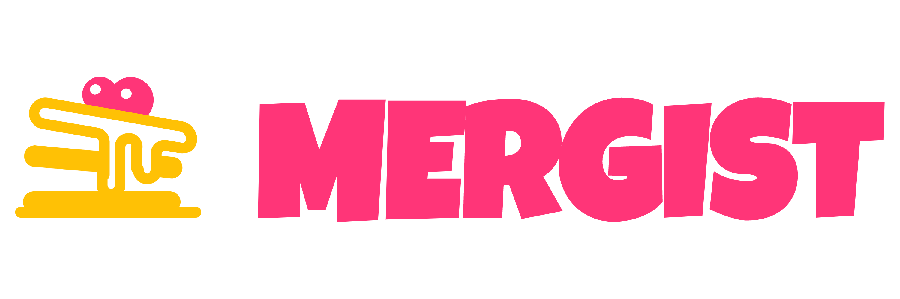

<!-- Project Header -->

  <h1 class="projectName">
    
  </h1>

  

    
    
    
    
		
  

  

    Mergist is an online tool to combine multiple PDF files into one. Mergist has no ads, no file size limits, and your files never leave your device.
  

   

## Installation
1. Install Node.js and NPM (if they are not already set up on your system). See [nodejs.org](https://nodejs.org/) for more details.
2. Install Yarn 3 (if it is not already set up on your system). See the [Yarn docs](https://yarnpkg.com/getting-started/install) for more details.
3. Clone the repo with `https://github.com/jerboa88/Mergist.git`. Alternatively, you can download the repository as a zip file and extract it.
4. Enter the project root with `cd Mergist`.
5. Use `yarn install` to install the app and all of its dependencies.

## Usage
Mergist is a static site built using the Gatsby framework. We can build the site using the Gatsby CLI, which should have been installed with the install command above. All of the necessary commands are declared in `package.json` for convenience.

There are two ways to build & serve the site:
1. Use `yarn develop` to run the app in development mode. This will start the development server at [localhost:8000](https://localhost:8000) (by default). The project will automatically be rebuilt when changes are made.

2. Use `yarn build` to generate a production build of the app, then use `yarn serve` to serve it. The site can be viewed at [localhost:9000](https://localhost:9000) (by default).

`yarn clean` can be used to clear the local Gatsby cache if you encounter any issues with stale data/dependencies.

See the [Gatsby CLI docs](https://www.gatsbyjs.com/docs/reference/gatsby-cli/) for additional commands and options. You will likely have to prefix commands with `yarn` to make sure package resolution works properly. For example, the above `yarn develop` is actually just a shortcut for `yarn gatsby develop`.

## Contributing
This a personal project but feel free to create an issue if you encounter any problems with the site. Please see [CONTRIBUTING.md](CONTRIBUTING.md) for more details.

## License
This project is licensed under the MIT License. See [LICENSE](LICENSE) for details. This project includes various resources which carry their own copyright notices and license terms. See [LICENSE-THIRD-PARTY.md](LICENSE-THIRD-PARTY.md) for more details.
