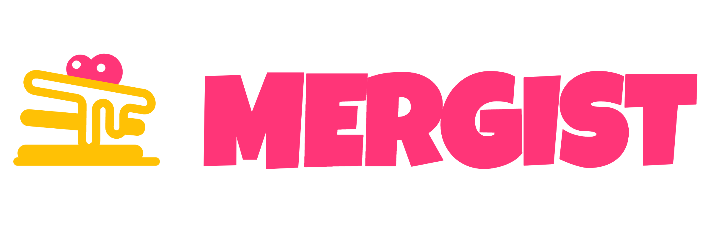

<!-- Project Header -->

	<h1 class="projectName">

  </h1>

  

  

    
    
    
    
  

  

    Mergist is an online tool to combine multiple PDF files into one. Mergist has no ads, no file size limits, and your files never leave your device.
  

   

## Installation
1. Install Node.js and NPM if they are not already set up on your system. See [nodejs.org](https://nodejs.org/) for more details.
2. Clone the repo and enter the project root with `cd Mergist`.
3. Use `npm install` to install the app and all of its dependencies.

## Usage
Mergist is a static site built using the Gatsby framework. The Gatsby CLI should already be installed after running the install command above. There are two options to serve the site:
1. Use `gatsby develop` to run the app in development mode. This will automatically reload the page when changes are made. The site should be visible at [localhost:8000](https://localhost:8000) by default
2. Use `gatsby build` to generate a production build of the app, then use `gatsby serve` to serve it. The site should be visible at [localhost:9000](https://localhost:9000) by default

Additional commands and options are available. See the [Gatsby CLI docs](https://www.gatsbyjs.com/docs/reference/gatsby-cli/) for more details.

## Contributing
This a personal project but feel free to create an issue if you encounter any problems with the site. Please see [CONTRIBUTING.md](CONTRIBUTING.md) for more details.

## License
This project is licensed under the MIT License. See [LICENSE](LICENSE) for details. This project includes various resources which carry their own copyright notices and license terms. See [LICENSE-THIRD-PARTY.md](LICENSE-THIRD-PARTY.md) for more details.
